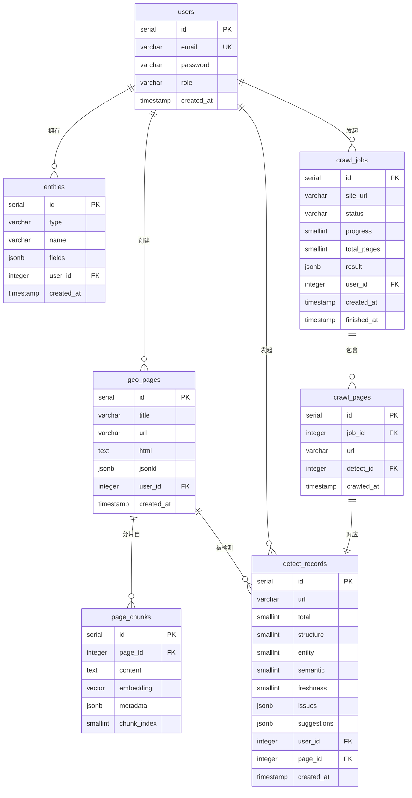

# GEO 工具平台 — ER 设计

> 版本：v1.0
> 日期：2026-06-28

---

## 一、ER 图



---

## 二、表说明

### users — 用户表

| 字段 | 类型 | 说明 |
|------|------|------|
| id | SERIAL PK | 自增主键 |
| email | VARCHAR(255) UK | 登录邮箱，唯一 |
| password | VARCHAR(255) | bcrypt 哈希，禁止存明文 |
| role | VARCHAR(50) | `admin` / `user`，默认 `user` |
| created_at | TIMESTAMP | 注册时间 |

---

### entities — 实体库

| 字段 | 类型 | 说明 |
|------|------|------|
| id | SERIAL PK | 自增主键 |
| type | VARCHAR(50) | `Product` / `FAQPage` / `Article` / `HowTo` / `Organization` |
| name | VARCHAR(255) | 实体名称，用于检索复用 |
| fields | JSONB | 实体字段，结构随 type 不同（见下方 fields schema）|
| user_id | INTEGER FK | 归属用户 |
| created_at | TIMESTAMP | 创建时间 |

**fields JSONB schema 示例**

```jsonc
// type = Product
{
  "brand": "品牌名",
  "model": "型号",
  "description": "产品描述",
  "price": "999",
  "currency": "CNY",
  "sku": "SKU-001",
  "specs": { "weight": "1.2kg", "color": "黑色" }
}

// type = FAQPage
{
  "questions": [
    { "q": "问题1", "a": "答案1" },
    { "q": "问题2", "a": "答案2" }
  ]
}

// type = HowTo
{
  "name": "操作名称",
  "steps": [
    { "name": "步骤1", "text": "详细说明" }
  ],
  "totalTime": "PT30M"
}
```

---

### geo_pages — GEO 生成页面

| 字段 | 类型 | 说明 |
|------|------|------|
| id | SERIAL PK | 自增主键 |
| title | VARCHAR(500) | 页面标题 |
| url | VARCHAR(2048) | 发布后的访问地址（可空，生成时尚无）|
| html | TEXT | 完整静态 HTML 内容 |
| jsonld | JSONB | 内嵌的 JSON-LD 结构化数据（冗余存储，便于索引）|
| user_id | INTEGER FK | 创建用户 |
| created_at | TIMESTAMP | 生成时间 |

---

### detect_records — 检测记录

| 字段 | 类型 | 说明 |
|------|------|------|
| id | SERIAL PK | 自增主键 |
| url | VARCHAR(2048) | 被检测的页面地址（外部 URL 或生成页）|
| total | SMALLINT | 综合得分 0-100 |
| structure | SMALLINT | 结构化得分 0-30 |
| entity | SMALLINT | 实体清晰度得分 0-30 |
| semantic | SMALLINT | 语义完整性得分 0-25 |
| freshness | SMALLINT | 时效/干净度得分 0-15 |
| issues | JSONB | 问题列表 `["缺少 JSON-LD", ...]` |
| suggestions | JSONB | 优化建议 `["添加 FAQPage schema", ...]` |
| page_id | INTEGER FK | 关联 geo_pages（检测平台自身生成页时赋值）|
| user_id | INTEGER FK | 发起检测的用户 |
| created_at | TIMESTAMP | 检测时间 |

---

### page_chunks — 向量分片

| 字段 | 类型 | 说明 |
|------|------|------|
| id | SERIAL PK | 自增主键 |
| page_id | INTEGER FK | 来源页面 |
| content | TEXT | 分片文本（200-500 字）|
| embedding | vector(1536) | pgvector 向量（OpenAI/通义千问维度）|
| metadata | JSONB | 实体标签、关键词、来源段落标题等 |
| chunk_index | SMALLINT | 分片序号（同一页面内有序）|

```sql
-- 向量索引（HNSW，余弦相似度）
CREATE INDEX ON page_chunks USING hnsw (embedding vector_cosine_ops);
```

---

### crawl_jobs — 爬虫任务

| 字段 | 类型 | 说明 |
|------|------|------|
| id | SERIAL PK | 自增主键 |
| site_url | VARCHAR(2048) | 目标站点根地址 |
| status | VARCHAR(50) | `pending` / `running` / `done` / `failed` |
| progress | SMALLINT | 已处理页面数 |
| total_pages | SMALLINT | 发现的总页面数 |
| result | JSONB | 汇总统计（平均分、问题分布等）|
| user_id | INTEGER FK | 发起用户 |
| created_at | TIMESTAMP | 任务创建时间 |
| finished_at | TIMESTAMP | 任务完成时间（可空）|

---

### crawl_pages — 爬虫子页记录

| 字段 | 类型 | 说明 |
|------|------|------|
| id | SERIAL PK | 自增主键 |
| job_id | INTEGER FK | 所属爬虫任务 |
| url | VARCHAR(2048) | 该子页地址 |
| detect_id | INTEGER FK | 对应的检测记录 |
| crawled_at | TIMESTAMP | 爬取时间 |

---

## 三、关键约束与索引

```sql
-- 唯一约束
ALTER TABLE users ADD CONSTRAINT uq_users_email UNIQUE (email);

-- 外键
ALTER TABLE entities       ADD CONSTRAINT fk_entities_user       FOREIGN KEY (user_id)    REFERENCES users(id);
ALTER TABLE geo_pages      ADD CONSTRAINT fk_geo_pages_user       FOREIGN KEY (user_id)    REFERENCES users(id);
ALTER TABLE detect_records ADD CONSTRAINT fk_detect_user          FOREIGN KEY (user_id)    REFERENCES users(id);
ALTER TABLE detect_records ADD CONSTRAINT fk_detect_page          FOREIGN KEY (page_id)    REFERENCES geo_pages(id);
ALTER TABLE page_chunks    ADD CONSTRAINT fk_chunks_page          FOREIGN KEY (page_id)    REFERENCES geo_pages(id);
ALTER TABLE crawl_jobs     ADD CONSTRAINT fk_crawl_jobs_user      FOREIGN KEY (user_id)    REFERENCES users(id);
ALTER TABLE crawl_pages    ADD CONSTRAINT fk_crawl_pages_job      FOREIGN KEY (job_id)     REFERENCES crawl_jobs(id);
ALTER TABLE crawl_pages    ADD CONSTRAINT fk_crawl_pages_detect   FOREIGN KEY (detect_id)  REFERENCES detect_records(id);

-- 常用查询索引
CREATE INDEX idx_entities_user          ON entities(user_id);
CREATE INDEX idx_entities_type          ON entities(type);
CREATE INDEX idx_geo_pages_user         ON geo_pages(user_id);
CREATE INDEX idx_detect_records_user    ON detect_records(user_id);
CREATE INDEX idx_detect_records_url     ON detect_records(url);
CREATE INDEX idx_detect_records_page    ON detect_records(page_id);
CREATE INDEX idx_page_chunks_page       ON page_chunks(page_id);
CREATE INDEX idx_crawl_jobs_user        ON crawl_jobs(user_id);
CREATE INDEX idx_crawl_jobs_status      ON crawl_jobs(status);
CREATE INDEX idx_crawl_pages_job        ON crawl_pages(job_id);

-- 向量相似度索引（pgvector HNSW）
CREATE INDEX idx_page_chunks_embedding  ON page_chunks USING hnsw (embedding vector_cosine_ops);
```

---

## 四、实体关系说明

| 关系 | 类型 | 说明 |
|------|------|------|
| users → entities | 1:N | 一个用户可维护多个实体模板 |
| users → geo_pages | 1:N | 一个用户可生成多个 GEO 页面 |
| users → detect_records | 1:N | 一个用户可发起多次检测 |
| users → crawl_jobs | 1:N | 一个用户可发起多个爬虫任务 |
| geo_pages → page_chunks | 1:N | 一个页面切分为多个向量分片 |
| geo_pages → detect_records | 1:N | 同一页面可多次检测（记录历史变化）|
| crawl_jobs → crawl_pages | 1:N | 一个爬虫任务包含多个子页记录 |
| crawl_pages → detect_records | 1:1 | 每个爬取子页对应一条检测记录 |
