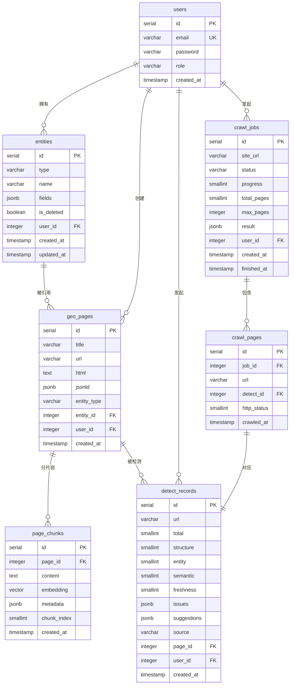

# GEO 工具平台 — 业务功能提取与数据库设计

> 版本：v1.0
> 日期：2026-06-28

---

## 一、业务功能模块全景

```
GEO 工具平台
├── 用户中心
│   ├── 注册 / 登录 / 登出
│   └── 个人信息管理
│
├── 内容生成（F1）
│   ├── 单页 GEO 内容生成
│   │   ├── 选择实体类型（Product / FAQPage / Article / HowTo / Organization）
│   │   ├── 填写实体字段
│   │   ├── 自动抽取 NER 实体
│   │   ├── 生成 JSON-LD 结构化标签
│   │   └── 渲染纯静态 HTML 并下载
│   └── 批量 GEO 文章生成（F4，进阶）
│       ├── 上传实体模板批次
│       └── LLM API 填充生成
│
├── GEO 合规检测（F2）
│   ├── 单 URL 检测
│   ├── 粘贴 HTML 检测
│   ├── 四维打分报告
│   │   ├── 结构化得分（0-30）
│   │   ├── 实体清晰度（0-30）
│   │   ├── 语义完整性（0-25）
│   │   └── 时效/干净度（0-15）
│   ├── 问题列表 + 优化建议
│   └── 历史检测记录查询
│
├── 向量处理（F3）
│   ├── 文本语义分片（200-500 字/片）
│   ├── 批量 Embedding 向量化
│   ├── 向量分片预览
│   └── RAG 素材包导出（JSON / CSV）
│
├── 实体库（F5，进阶）
│   ├── 实体新增 / 编辑 / 删除
│   ├── 按类型检索复用
│   └── 实体字段模板管理
│
└── 站点爬虫自检（F6，进阶）
    ├── 输入目标站点 URL
    ├── 异步爬取（遵守 robots.txt，限速）
    ├── 任务进度实时查询
    ├── 子页批量 GEO 打分
    └── 站点整体报告导出
```

---

## 二、业务功能详细说明

### 2.1 用户中心

| 功能点 | 描述 | 接口 |
|--------|------|------|
| 注册 | 邮箱 + 密码注册，bcrypt 加密存储 | `POST /api/auth/register` |
| 登录 | 邮箱 + 密码，返回 JWT Token | `POST /api/auth/login` |
| 登出 | 客户端清除 Token（无状态）| 客户端操作 |
| 个人信息 | 查看邮箱、角色、注册时间 | `GET /api/auth/me` |

**业务规则**
- Token 有效期 24 小时，Refresh Token 7 天
- 管理员（role=admin）可查看所有用户数据；普通用户仅访问自己的数据
- 密码最短 8 位，必须含字母+数字

---

### 2.2 内容生成（F1 / F4）

#### 单页 GEO 内容生成流程

```
用户填写表单
    │
    ▼
NER 实体抽取（ner.py）
    │  品牌、产品名、参数数值、关键词
    ▼
JSON-LD 生成（jsonld.py）
    │  根据 type 选择模板，填充字段
    ▼
HTML 页面渲染（page_generator.py）
    │  Jinja2 模板 + 内嵌 JSON-LD + 语义标签
    ▼
存储到 geo_pages 表
    │
    ▼
返回 HTML 内容 + 下载链接
```

| 功能点 | 描述 | 接口 |
|--------|------|------|
| 生成 GEO 页面 | 输入实体信息，返回静态 HTML | `POST /api/geo/generate` |
| 下载 HTML | 按 page_id 下载生成页文件 | `GET /api/geo/download/{id}` |
| 查看历史 | 分页查询已生成的页面列表 | `GET /api/geo/pages` |
| 删除页面 | 删除指定生成页及其分片 | `DELETE /api/geo/pages/{id}` |
| 批量生成文章 | 提交批次任务，异步 LLM 填充（进阶）| `POST /api/geo/batch` |

**支持的 JSON-LD 实体类型**

| 类型 | 适用场景 | 必填字段 |
|------|----------|----------|
| Product | 产品/商品页 | name, description, brand |
| FAQPage | 常见问题页 | questions[{q, a}] |
| Article | 文章/博客 | headline, author, datePublished |
| HowTo | 操作指南 | name, steps[{name, text}] |
| Organization | 品牌/公司介绍 | name, url, description |

---

### 2.3 GEO 合规检测（F2）

#### 四维打分算法

```
输入：URL 或 HTML 文本
         │
         ├── 结构化得分（满分 30）
         │     BeautifulSoup DOM 解析
         │     ├─ JSON-LD 存在且合法          +15
         │     ├─ JSON-LD 类型数量（每多一类  +3，上限 +9）
         │     ├─ 语义标签 <article>/<dl>/<section> +3
         │     ├─ FAQ 列表 <dl>/<details>      +2
         │     └─ 参数表格 <table>             +1
         │
         ├── 实体清晰度（满分 30）
         │     NER 抽取品牌/产品/参数/数值
         │     ├─ 实体密度（实体数/总词数）    0-15
         │     ├─ 唯一标识度（品牌或产品名）   0-10
         │     └─ 数值参数存在性              0-5
         │
         ├── 语义完整性（满分 25）
         │     MVP：标题-正文关键词覆盖率      0-25
         │     进阶：Embedding 余弦相似度      0-25
         │
         └── 时效/干净度（满分 15）
               ├─ 无广告弹窗/悬浮层           +5
               ├─ 无大量无关外链              +5
               └─ 无重复段落/过期时间戳        +5
```

| 功能点 | 描述 | 接口 |
|--------|------|------|
| URL 检测 | 输入 URL，自动抓取并打分 | `POST /api/detect/url` |
| HTML 检测 | 直接粘贴 HTML 打分 | `POST /api/detect/html` |
| 检测历史 | 分页查询历史检测记录 | `GET /api/detect/records` |
| 单条详情 | 查看某次检测的完整报告 | `GET /api/detect/records/{id}` |

**输出结构**
```json
{
  "total": 78,
  "structure": 24,
  "entity": 22,
  "semantic": 20,
  "freshness": 12,
  "issues": ["缺少 HowTo 结构化标签", "检测到重复段落 3 处"],
  "suggestions": ["添加 FAQPage JSON-LD", "移除页面底部广告区块"]
}
```

---

### 2.4 向量处理（F3）

#### 分片与向量化流程

```
输入 HTML / 文本
    │
    ▼
splitter.py  语义分片
    │  句子边界切割，200-500 字/片
    │  每片绑定：标题来源、实体标签、chunk_index
    ▼
embedder.py  批量向量化
    │  SHA-256 → Redis 查缓存（TTL 7天）
    │  未命中 → 调用 Embedding API
    │  写入 Redis 缓存
    ▼
存储到 page_chunks 表（pgvector）
    │
    ▼
导出 JSON / CSV（含 content + embedding + metadata）
```

| 功能点 | 描述 | 接口 |
|--------|------|------|
| 执行分片 | 对指定 page_id 进行分片+向量化 | `POST /api/vector/chunk` |
| 分片预览 | 查看某页面的所有分片列表 | `GET /api/vector/chunks/{page_id}` |
| 导出 JSON | 下载 RAG 素材包（JSON）| `GET /api/vector/export/{page_id}?format=json` |
| 导出 CSV | 下载 RAG 素材包（CSV）| `GET /api/vector/export/{page_id}?format=csv` |

**导出字段**

| 字段 | 说明 |
|------|------|
| chunk_id | 分片唯一 ID |
| page_id | 来源页面 ID |
| chunk_index | 分片序号 |
| content | 分片文本 |
| embedding | 向量数组（1536 维）|
| metadata.title | 所属段落标题 |
| metadata.entities | 该片抽取的实体列表 |
| metadata.keywords | 关键词列表 |

---

### 2.5 实体库（F5，进阶）

| 功能点 | 描述 | 接口 |
|--------|------|------|
| 新增实体 | 填写 type + name + fields 存入库 | `POST /api/entities` |
| 查询列表 | 按 type / name 关键词过滤 | `GET /api/entities` |
| 编辑实体 | 更新 fields 字段 | `PUT /api/entities/{id}` |
| 删除实体 | 软删除（保留历史引用）| `DELETE /api/entities/{id}` |
| 复用实体 | 生成时选择已有实体填充表单 | 前端调用列表接口 |

---

### 2.6 站点爬虫自检（F6，进阶）

#### 爬虫任务流程

```
用户提交 site_url
    │
    ▼
创建 crawl_jobs 记录（status=pending）
返回 job_id
    │
    ▼
Celery 异步任务 task_crawl_site(job_id)
    │
    ├─ 解析 robots.txt，获取 Disallow 规则
    ├─ 爬取首页，提取同域内链
    ├─ 按队列逐页爬取（1-2s 随机间隔，随机 UA）
    │     每页：
    │     ├─ 写入 crawl_pages 记录
    │     ├─ 调用 scorer.py.score(html)
    │     └─ 写入 detect_records，关联 crawl_pages
    └─ 全部完成 → 更新 crawl_jobs.status=done，汇总 result
```

| 功能点 | 描述 | 接口 |
|--------|------|------|
| 发起爬取 | 提交站点 URL，返回 job_id | `POST /api/crawler/start` |
| 查询进度 | 轮询任务状态与进度百分比 | `GET /api/crawler/status/{job_id}` |
| 停止任务 | 终止运行中的爬虫任务 | `DELETE /api/crawler/stop/{job_id}` |
| 任务列表 | 查询历史爬虫任务 | `GET /api/crawler/jobs` |
| 站点报告 | 查看某任务的全站打分汇总 | `GET /api/crawler/report/{job_id}` |

---

## 三、完整数据库设计

### 3.1 ER 图



---

### 3.2 建表 DDL

```sql
-- 启用 pgvector 扩展
CREATE EXTENSION IF NOT EXISTS vector;

-- ───────────────────────────────────────────────
-- 1. 用户表
-- ───────────────────────────────────────────────
CREATE TABLE users (
    id          SERIAL PRIMARY KEY,
    email       VARCHAR(255) NOT NULL,
    password    VARCHAR(255) NOT NULL,
    role        VARCHAR(50)  NOT NULL DEFAULT 'user',   -- user | admin
    created_at  TIMESTAMP    NOT NULL DEFAULT NOW(),
    CONSTRAINT uq_users_email UNIQUE (email)
);

-- ───────────────────────────────────────────────
-- 2. 实体库
-- ───────────────────────────────────────────────
CREATE TABLE entities (
    id          SERIAL PRIMARY KEY,
    type        VARCHAR(50)  NOT NULL,   -- Product|FAQPage|Article|HowTo|Organization
    name        VARCHAR(255) NOT NULL,
    fields      JSONB        NOT NULL DEFAULT '{}',
    is_deleted  BOOLEAN      NOT NULL DEFAULT FALSE,
    user_id     INTEGER      NOT NULL REFERENCES users(id),
    created_at  TIMESTAMP    NOT NULL DEFAULT NOW(),
    updated_at  TIMESTAMP    NOT NULL DEFAULT NOW()
);

-- ───────────────────────────────────────────────
-- 3. GEO 生成页面
-- ───────────────────────────────────────────────
CREATE TABLE geo_pages (
    id          SERIAL PRIMARY KEY,
    title       VARCHAR(500),
    url         VARCHAR(2048),
    html        TEXT         NOT NULL,
    jsonld      JSONB        NOT NULL DEFAULT '{}',
    entity_type VARCHAR(50),
    entity_id   INTEGER      REFERENCES entities(id) ON DELETE SET NULL,
    user_id     INTEGER      NOT NULL REFERENCES users(id),
    created_at  TIMESTAMP    NOT NULL DEFAULT NOW()
);

-- ───────────────────────────────────────────────
-- 4. 检测记录
-- ───────────────────────────────────────────────
CREATE TABLE detect_records (
    id          SERIAL PRIMARY KEY,
    url         VARCHAR(2048),
    total       SMALLINT     CHECK (total    BETWEEN 0 AND 100),
    structure   SMALLINT     CHECK (structure BETWEEN 0 AND 30),
    entity      SMALLINT     CHECK (entity   BETWEEN 0 AND 30),
    semantic    SMALLINT     CHECK (semantic BETWEEN 0 AND 25),
    freshness   SMALLINT     CHECK (freshness BETWEEN 0 AND 15),
    issues      JSONB        NOT NULL DEFAULT '[]',
    suggestions JSONB        NOT NULL DEFAULT '[]',
    source      VARCHAR(50)  NOT NULL DEFAULT 'manual', -- manual | crawler
    page_id     INTEGER      REFERENCES geo_pages(id) ON DELETE SET NULL,
    user_id     INTEGER      NOT NULL REFERENCES users(id),
    created_at  TIMESTAMP    NOT NULL DEFAULT NOW()
);

-- ───────────────────────────────────────────────
-- 5. 向量分片
-- ───────────────────────────────────────────────
CREATE TABLE page_chunks (
    id          SERIAL PRIMARY KEY,
    page_id     INTEGER      NOT NULL REFERENCES geo_pages(id) ON DELETE CASCADE,
    content     TEXT         NOT NULL,
    embedding   vector(1536),
    metadata    JSONB        NOT NULL DEFAULT '{}',
    chunk_index SMALLINT     NOT NULL,
    created_at  TIMESTAMP    NOT NULL DEFAULT NOW(),
    CONSTRAINT uq_chunk_index UNIQUE (page_id, chunk_index)
);

-- ───────────────────────────────────────────────
-- 6. 爬虫任务
-- ───────────────────────────────────────────────
CREATE TABLE crawl_jobs (
    id          SERIAL PRIMARY KEY,
    site_url    VARCHAR(2048) NOT NULL,
    status      VARCHAR(50)   NOT NULL DEFAULT 'pending', -- pending|running|done|failed
    progress    SMALLINT      NOT NULL DEFAULT 0,
    total_pages SMALLINT      NOT NULL DEFAULT 0,
    max_pages   INTEGER       NOT NULL DEFAULT 100,
    result      JSONB         NOT NULL DEFAULT '{}',
    user_id     INTEGER       NOT NULL REFERENCES users(id),
    created_at  TIMESTAMP     NOT NULL DEFAULT NOW(),
    finished_at TIMESTAMP
);

-- ───────────────────────────────────────────────
-- 7. 爬虫子页记录
-- ───────────────────────────────────────────────
CREATE TABLE crawl_pages (
    id          SERIAL PRIMARY KEY,
    job_id      INTEGER       NOT NULL REFERENCES crawl_jobs(id) ON DELETE CASCADE,
    url         VARCHAR(2048) NOT NULL,
    detect_id   INTEGER       REFERENCES detect_records(id) ON DELETE SET NULL,
    http_status SMALLINT,
    crawled_at  TIMESTAMP     NOT NULL DEFAULT NOW()
);
```

---

### 3.3 索引

```sql
-- 用户
CREATE INDEX idx_users_email             ON users(email);

-- 实体库
CREATE INDEX idx_entities_user           ON entities(user_id);
CREATE INDEX idx_entities_type           ON entities(type);
CREATE INDEX idx_entities_name           ON entities(name varchar_pattern_ops); -- LIKE 前缀搜索

-- GEO 页面
CREATE INDEX idx_geo_pages_user          ON geo_pages(user_id);
CREATE INDEX idx_geo_pages_entity        ON geo_pages(entity_id);
CREATE INDEX idx_geo_pages_created       ON geo_pages(created_at DESC);

-- 检测记录
CREATE INDEX idx_detect_records_user     ON detect_records(user_id);
CREATE INDEX idx_detect_records_url      ON detect_records(url);
CREATE INDEX idx_detect_records_page     ON detect_records(page_id);
CREATE INDEX idx_detect_records_source   ON detect_records(source);
CREATE INDEX idx_detect_records_created  ON detect_records(created_at DESC);

-- 向量分片
CREATE INDEX idx_page_chunks_page        ON page_chunks(page_id);
CREATE INDEX idx_page_chunks_embedding   ON page_chunks USING hnsw (embedding vector_cosine_ops);

-- 爬虫任务
CREATE INDEX idx_crawl_jobs_user         ON crawl_jobs(user_id);
CREATE INDEX idx_crawl_jobs_status       ON crawl_jobs(status);
CREATE INDEX idx_crawl_jobs_created      ON crawl_jobs(created_at DESC);

-- 爬虫子页
CREATE INDEX idx_crawl_pages_job         ON crawl_pages(job_id);
```

---

### 3.4 表与业务功能对应关系

| 表 | 写入时机 | 主要查询场景 |
|----|----------|------------|
| users | 注册 | 登录鉴权、权限校验 |
| entities | 实体库新增/编辑 | 生成页面时选择复用实体 |
| geo_pages | 生成 GEO 页面 | 历史列表、分片、检测关联 |
| detect_records | 单次检测 / 爬虫子页检测 | 报告查看、历史趋势 |
| page_chunks | 向量分片操作 | RAG 导出、语义打分（进阶）|
| crawl_jobs | 发起爬虫任务 | 进度轮询、站点报告 |
| crawl_pages | 爬虫爬取每一子页后 | 站点报告子页详情 |

---

### 3.5 关键字段设计说明

**entities.fields JSONB 结构（按 type）**

```jsonc
// Product
{
  "brand": "小米",
  "model": "Redmi Note 13",
  "description": "产品描述文本",
  "price": "1299",
  "currency": "CNY",
  "sku": "SKU-001",
  "specs": { "weight": "189g", "screen": "6.67英寸" }
}

// FAQPage
{
  "questions": [
    { "q": "支持 5G 吗？", "a": "支持 5G 双卡双待" }
  ]
}

// Article
{
  "headline": "文章标题",
  "author": "作者名",
  "datePublished": "2026-06-28",
  "description": "文章摘要",
  "keywords": ["GEO", "RAG", "LLM"]
}

// HowTo
{
  "name": "如何安装 pgvector",
  "totalTime": "PT10M",
  "steps": [
    { "name": "安装扩展", "text": "执行 CREATE EXTENSION vector;" }
  ]
}

// Organization
{
  "name": "公司名称",
  "url": "https://example.com",
  "description": "公司简介",
  "logo": "https://example.com/logo.png",
  "contactPoint": { "telephone": "400-xxx-xxxx", "email": "hi@example.com" }
}
```

**crawl_jobs.result JSONB 结构**

```jsonc
{
  "avg_total": 72,
  "avg_structure": 22,
  "avg_entity": 20,
  "avg_semantic": 18,
  "avg_freshness": 12,
  "score_distribution": {
    "0-40":  3,
    "41-60": 12,
    "61-80": 28,
    "81-100": 7
  },
  "top_issues": [
    { "issue": "缺少 JSON-LD", "count": 31 },
    { "issue": "实体密度过低", "count": 24 }
  ]
}
```

**page_chunks.metadata JSONB 结构**

```jsonc
{
  "title": "所属段落 H2/H3 标题",
  "entities": ["小米", "Redmi Note 13", "5G"],
  "keywords": ["性能", "续航", "拍照"],
  "char_count": 312
}
```

---

## 四、数据流向总览

```
用户操作
   │
   ├─ 注册/登录 ──────────────────────────────→ users
   │
   ├─ 新建实体 ────────────────────────────────→ entities
   │
   ├─ 生成 GEO 页面
   │       entities（可选复用）
   │       └─ geo_pages（存 html + jsonld）
   │               └─ page_chunks（分片+向量，按需触发）
   │
   ├─ 单次检测（URL / HTML）
   │       geo_pages（可选关联）
   │       └─ detect_records（存四维分 + issues）
   │
   └─ 爬虫任务
           crawl_jobs（任务元信息）
           └─ crawl_pages（每个子页）
                   └─ detect_records（每页打分，source=crawler）
```

---

## 五、MVP 阶段最小数据库子集

MVP（Day 1-7）只需以下 5 张表，其余进阶时补充：

| 表 | 是否 MVP 必须 | 说明 |
|----|:---:|------|
| users | ✅ | 基础鉴权 |
| geo_pages | ✅ | F1 核心 |
| detect_records | ✅ | F2 核心 |
| page_chunks | ✅ | F3 核心 |
| entities | ⬜ 进阶 | F5，MVP 可跳过 |
| crawl_jobs | ⬜ 进阶 | F6，MVP 可跳过 |
| crawl_pages | ⬜ 进阶 | F6，MVP 可跳过 |
